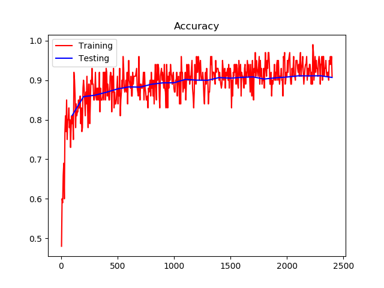
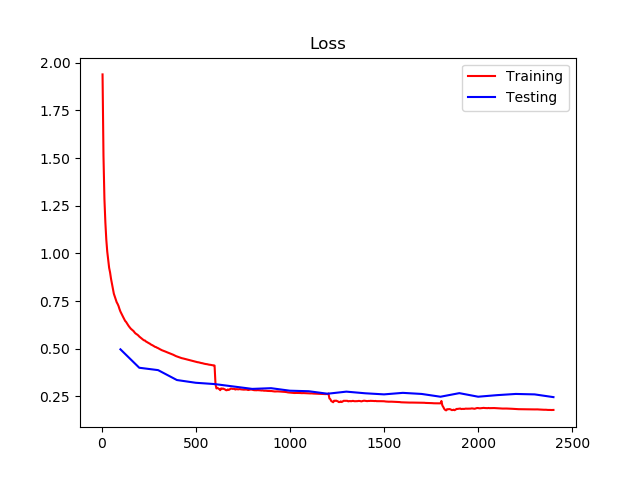

# Assignment 1: Object Classification with TensorFlow!

- Anuj Pahuja (apahuja)


## Task 0: Fashion MNIST classification in TensorFlow (5 points)

#### Q 0.1: Both scripts use the same neural network model, how many trainable parameters does each layer have?

Total trainable parameters - 3,274,634
Conv1 - 832
Pool1 - 0
Conv2 - 51,264
Pool2 - 0
FC1 - 3,212,288
Dropout - 0
FC2 - 10,250

#### Q 0.2: Show the loss and accuracy curves for both scripts with the default hyperparameters.

Script `00_fashion_mnist.py` :




Script `01_fashion_mnist.py` :




#### Q 0.3: Why do the plots from two scripts look different? Why does the second script show smoother loss? Why are there three jumps in the training curves?

The plots are different because the first script logs losses and accuracy per batch whereas the second script logs a running average for loss and acuuracy for an epoch. Since batch-wise statistics can be very noisy, we see a noisy curve for the first script whereas the running average smoothens the loss curve in the other case. The three jumps are caused on completion of every epoch. Since the loss would be high initially for an epoch, the running average will be also be affected by it. As soon as we start a new epoch, the previous epoch statistics go away and the curve starts with a loss value that is not affected by the high loss occured in the initial stages of previous epoch, hence the sudden jump.

#### Q 0.4: What happens if you train the network for 10 epochs?

The networks tend to overfit on the training data as we can see reduction in training loss and increase in training accuracy but no change/increase in test loss and no change/decrease in test accuracy.

Script `00_fashion_mnist.py` :


Script `01_fashion_mnist.py` :


## Task 1: Simple CNN network for PASCAL multi-label classification (20 points)


### 1.1: Write a data loader for PASCAL 2007.

Done in `util.py`.

### 1.2 Data Augmentation and Dataset Generation

Done in `02_pascal.py`.

### 1.3: Modify the Fashion MNIST model to be suitable for multi-label classification.

Done in `02_pascal.py`.

### 1.4 Measure Performance

Implemented in `util.py`.

### 1.5 Setup tensorboard

Done in `02_pascal.py`.

#### Q 1.1 Show clear screenshots of the learning curves of testing MAP and training loss for 5 epochs (batch size=20, learning rate=0.001). Please evaluate your model to calculate the MAP on the testing dataset every 50 iterations. 


## Task 2: Lets go deeper! CaffeNet for PASCAL classification (20 points)

As you might have seen, the performance of our simple CNN mode was pretty low for PASCAL. This is expected as PASCAL is much more complex than FASHION MNIST, and we need a much beefier model to handle it. Copy over your code from `02_pascal.py` to `03_pascal_caffenet.py`, and lets implement a deep CNN.


In this task we will be constructing a variant of the [alexnet](https://papers.nips.cc/paper/4824-imagenet-classification-with-deep-convolutional-neural-networks.pdf) architecture, known as CaffeNet. If you are familiar with Caffe, a prototxt of the network is available [here](https://github.com/BVLC/caffe/blob/master/models/bvlc_reference_caffenet/train_val.prototxt). A visualization of the network is available [here](http://ethereon.github.io/netscope/#/preset/caffenet)


### 2.1 Build CaffeNet

Here is the exact model we want to build. We use the following operator notation for the architecture:

1. Convolution: A convolution with kernel size `k`, stride `s`, output channels `n`, padding `p`, is represented as `conv(k, s, n, p)`.
2. Max Pooling: A max pool operation with kernel size `k`, stride `s` as `max_pool(k, s)`.
3. Fully connected: For `n` units, `fully_connected(n)`.

```txt
ARCHITECTURE:
	-> image
	-> conv(11, 4, 96, 'VALID')
	-> relu()
	-> max_pool(3, 2)
	-> conv(5, 1, 256, 'SAME')
	-> relu()
	-> max_pool(3, 2)
	-> conv(3, 1, 384, 'SAME')
	-> relu()
	-> conv(3, 1, 384, 'SAME')
	-> relu()
	-> conv(3, 1, 256, 'SAME')
	-> relu()
	-> max_pool(3, 2)
	-> flatten()
	-> fully_connected(4096)
	-> relu()
	-> dropout(0.5)
	-> fully_connected(4096)
	-> relu()
	-> dropout(0.5)
	-> fully_connected(20)
```

### 2.2 Setup Solver Hyperparameters

Please modify your code to use the following hyperparameter settings.

1. Change the optimizer to SGD + Momentum, with momentum of 0.9.
1. Use an exponentially decaying learning rate schedule, that starts at 0.001, and decays by 0.5 every 5K iterations.
1. Use batch size 20.

### 2.3 Save the model

Please add code for saving the model periodically (save at least **30** checkpoints during training for Task 2). Please save the models for **all the remaining scripts** (Task 3 and Task 4). And for Task 3 and Task 4, you only need to save the model in the end of training.You will need these models later. 


#### Q 2.1 Show clear screenshots of testing MAP and training loss for 60 epochs. Please evaluate your model to calculate the MAP on the testing dataset every 250 iterations. 


## Task 3: Even deeper! VGG-16 for PASCAL classification (15 points)

Hopefully we all got much better accuracy with the deeper model! Since 2012, many other deeper architectures have been proposed, and [VGG-16](https://arxiv.org/abs/1409.1556) is one of the popular ones. In this task, we attempt to further improve the performance with the "very deep" VGG-16 architecture. Copy over your code from `02_pascal.py` to `04_pascal_vgg_scratch.py` and modify the code.

### 3.1: Build VGG-16
Modify the network architecture from Task 2 to implement the VGG-16 architecture (refer to the original paper). 

### 3.2: Setup TensorBoard
Add code to use tensorboard for visualizing a) Training loss, b) Learning rate, c) Histograms of gradients, d) Training images

Use the same hyperparameter settings from Task 2, and try to train the model. 

#### Q 3.1 Add screenshots of training and testing loss, testing MAP curves, learning rate, histograms of gradients and examples of training images from TensorBoard.

## Task 4: Standing on the shoulder of the giants: finetuning from ImageNet (20 points)
As we have already seen, deep networks can sometimes be hard to optimize, while other times lead to heavy overfitting on small training sets. Many approaches have been proposed to counter this, eg, [Krahenbuhl et al. (ICLR'16)](http://arxiv.org/pdf/1511.06856.pdf) and other works we have seen in un-/self-supervised learning. However, the most effective approach remains pre-training the network on large, well-labeled datasets such as ImageNet. While training on the full ImageNet data is beyond the scope of this assignment, people have already trained many popular/standard models and released them online. In this task, we will initialize the VGG model from the previous task with pre-trained ImageNet weights, and *finetune* the network for PASCAL classification. 

Link for VGG-16 pretrained model in Keras:

```bash
https://github.com/fchollet/deep-learning-models/releases/download/v0.1/vgg16_weights_tf_dim_ordering_tf_kernels.h5
```

Copy over your code from `02_pascal.py` to `05_pascal_vgg_finetune.py` and modify the code.

### 4.1: Load pre-trained model
Load the pre-trained weights upto fc7 layer, and initialize fc8 weights and biases from scratch. Then train the network as before. You may use funtions such as `tf.keras.utils.get_file`, `
tf.keras.models.load_weights`. Since the pretrained model might use different names for the weights, you need to figure out how to load the weights correctly.

#### Q4.1: Use similar hyperparameter setup as in the scratch case, however, let the learning rate start from 0.0001, and decay by 0.5 every 1K iterations. Show the learning curves (training and testing loss, testing MAP) for 10 epochs. Please evaluate your model to calculate the MAP on the testing dataset every 60 iterations. 

## Task 5: Analysis (20 points)

By now we should have a good idea of training networks from scratch or from pre-trained model, and the relative performance in either scenarios. Needless to say, the performance of these models is way stronger than previous non-deep architectures we used until 2012. However, final performance is not the only metric we care about. It is important to get some intuition of what these models are really learning. Lets try some standard techniques.

#### Q5.1: Conv-1 filters
Extract and compare the conv1 filters from CaffeNet in Task 2, at different stages of the training. Show at least 3 filters.

#### Q5.2: Nearest neighbors
Pick 10 images from PASCAL test set from different classes, and compute 4 nearest neighbors of those images over the test set. You should use and compare the following feature representations for the nearest neighbors:

1. pool5 features from the CaffeNet (trained from scratch)
1. fc7 features from the CaffeNet (trained from scratch)
1. pool5 features from the VGG (finetuned from ImageNet)
1. fc7 features from VGG (finetuned from ImageNet)

Show the 10 images you chose and their 4 nearest neighbors for each case.

#### Q5.3: t-SNE visualization of intermediate features
We can also visualize how the feature representations specialize for different classes. Take 1000 random images from the test set of PASCAL, and extract caffenet (scratch) `fc7` features from those images. Compute a 2D [t-SNE projection](http://scikit-learn.org/stable/modules/generated/sklearn.manifold.TSNE.html) of the features, and plot them with each feature color coded by the GT class of the corresponding image. If multiple objects are active in that image, compute the color as the "mean" color of the different classes active in that image. Legend the graph with the colors for each object class.

#### Q5.4: Are some classes harder?
Show the per-class performance of your caffenet (scratch) and VGG-16 (finetuned) models. Try to explain, by observing examples from the dataset, why some classes are harder or easier than the others (consider the easiest and hardest class). Do some classes see large gains due to pre-training? Can you explain why that might happen?

## Task 6 (Extra Credit): Improve the classification performance (20 points)
Many techniques have been proposed in the literature to improve classification performance for deep networks. In this section, we try to use a recently proposed technique called [*mixup*](https://arxiv.org/abs/1710.09412). The main idea is to augment the training set with linear combinations of images and labels. Read through the paper and modify your model to implement mixup. Report your performance, along with training/test curves, and comparison with baseline in the report.


## Acknowledgements
Parts of the starter code are taken from official TensorFlow tutorials. Many thanks to the original authors!
